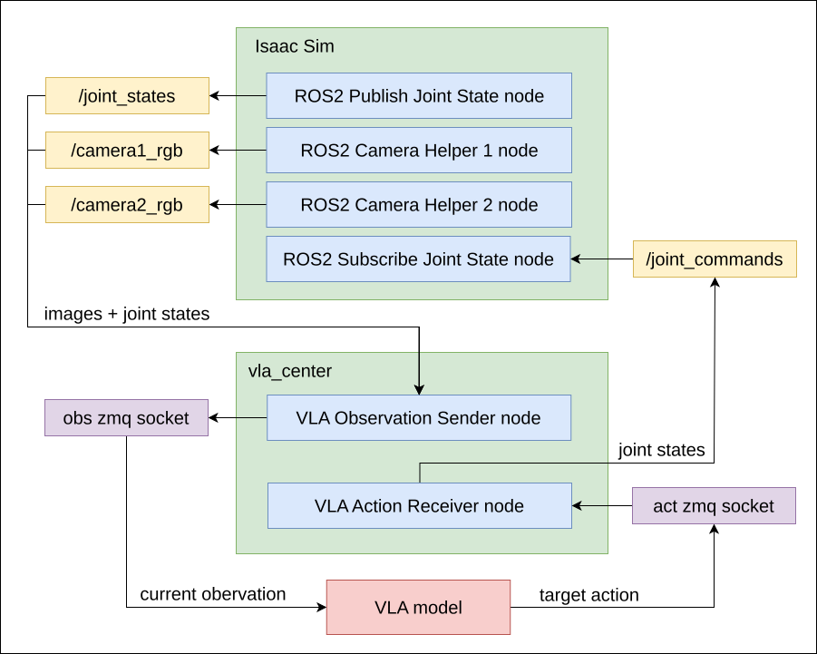

# isaacsim_vla_ws: ROS2 workspace for VLA model with Isaac Sim

This ROS2 workspace provides packages to implement message communication between Isaac Sim and VLA model, including images, current and target joint states of robot arm. It also contains some utility commands for Isaac Sim.

<!--  -->

## Table of Contents

- [Requirements](#requirements)
- [About](#about)
- [Installation](#installation)
- [Usage](#usage)

---

## Requirements

This package is tested on the following environment configuration:

- Ubuntu22.04
- [ROS2 humble](https://docs.ros.org/en/humble/Installation/Ubuntu-Install-Debs.html)
- System python 3.10
- [Isaac Sim 5.1.0](https://docs.isaacsim.omniverse.nvidia.com/5.1.0/index.html)

---

## About

This workspace works for 2 aspects.

#### 1. Utility commands for Isaac Sim

This workspace provides helpful commands to:

1. Start Isaac Sim GUI with specified robot arm USD;

2. Visulize the image topics messages from simulated camera in Rviz2;

3. Quickly test controller of robot arm, by giving one-time target state;

#### 2. Message exchange

The following diagram describes how messages are exchanged between Isaac Sim and VLA model ([Lerobot SmolVLA](git@github.com:MyLovelyAxe/lerobot.git) in this project) with management of package `vla_center`, including images, joint states of robot arm, between Isaac Sim and VLA model:



1. the topica `/camera1_rgb` and `/camera2_rgb` receives RGB images from simulated camera in Isaac Sim, and sends them to **obs ZMQ socket**;

2. the topic `/joint_states` receives current joint states from simulated robot arm [SO100](https://docs.isaacsim.omniverse.nvidia.com/5.1.0/assets/usd_assets_robots.html) in Isaac Sim, and sends them to **obs ZMQ socket**;

3. the **obs ZMQ socket** sends the RGB images and current joint states to VLA model, i.e. [SmolVLA](git@github.com:MyLovelyAxe/lerobot.git);

4. the **act ZMQ socket** receives the result action values for each joint of robot arm from VLA model, and sends them to topic `/joint_commmand`, as target state in Isaac Sim;

---

## Installation

Please make sure the following setup is already done before installing this package:

- [ROS2 humble](https://docs.ros.org/en/humble/Installation/Ubuntu-Install-Debs.html) installed in system environment on Ubuntu22

- [Isaac Sim GUI 5.1.0](https://docs.isaacsim.omniverse.nvidia.com/5.1.0/index.html)

```bash
# Clone the workspace
cd
git clone git@github.com:MyLovelyAxe/isaacsim_vla_ws.git

# Build vla_center package
cd ~/isaacsim_vla_ws
colcon build --packages-select vla_center --symlink-install
```

As to the installation of VLA model, i.e. Lerobot SmolVLA, refer to [branch `camera/zmq_socket` of this forked repo from official lerobot repo](https://github.com/MyLovelyAxe/lerobot/tree/camera/zmq_socket).

## Usage

#### 1. Utility commands for Isaac Sim


> **Attention:**
> The `config/vla_so101_2cam.usd` for managing all robot, cameras and action graphs is based on a **local** reference of so100 robot. It refers to `config/Collected_so100` for the so100 prim, which is also included in this repo. You can also collect this Asset in Isaac Sim GUI, refer to [Isaac Sim instruction](https://docs.isaacsim.omniverse.nvidia.com/latest/assets/usd_assets_robots.html).


**Terminal 1**: Start Isaac Sim GUI

```bash
cd ~/isaacsim_vla_ws/bash
source setup_isaacsim.sh
./start_isaac_sim.sh
```

This starts Isaac Sim GUI with pre-defined USD for robot arm model SO100, including action graphs to publish current joint states and camera images;

> **Remember:**
> Press **PLAY** button in Isaac Sim to start simulation!

**[Optional] Terminal 2**: Test image topics 

```bash
cd ~/isaacsim_vla_ws/bash
source setup_systemros.sh
./test_image_topic_rviz.sh
```

This starts Rviz2 with pre-defined `.rviz` config, which visualizes images from image topics defined in Isaac Sim;

**[Optional] Terminal 3**: Test robot arm controller

```bash
cd ~/isaacsim_vla_ws/bash
source setup_systemros.sh
./give_joint_command.sh # give new target state
./reset_joint_command.sh # reset to initial state
```

This quickly test the controller node of action graph for the robot arm model, by giving one-time target state or reset to initial state, which is specified for robot SO100;

#### 2. Message exchange

vla_center package offers 2 node for exchanging message between ROS2 topics from Isaac Sim and ZMQ sockets from VLA model side.

> **TODO**: use one launch file to start both nodes

1. Send observation node

This node subscribes to the following topics:

- `/camera1_img`: front-view camera image
- `/camera2_img`: top-view camera image
- `/joint_states`: current joint state of robot arm

then publishes the packed message to a ZMQ socket (the VLA model subscribes to this socket for input).

In a new terminal, start this node by:

```bash
cd ~/isaacsim_vla_ws/
source bash/setup_systemros.sh
source install/setup.bash
ros2 run vla_center send_observation
```

2. Get action node

The VLA model returns action commands as target state to a ZMQ socket, this node subscribes to the socket and publishs the target state to ROS2 topic:

- `/joint_command`: target joint states for Isaac Sim controller node

In a new terminal, start this node by:

```bash
cd ~/isaacsim_vla_ws/
source bash/setup_systemros.sh
source install/setup.bash
ros2 run vla_center get_action
```

#### 3. Start VLA model

The [forked Lerobot repo](https://github.com/MyLovelyAxe/lerobot/tree/camera/zmq_socket) provides a script which lets SmolVLA subscribe to observation and publish action commands to Isaac Sim topics via zmq socket, independent of the required robot hardware.

Firstly make sure the forked lerobot repo is already setup. Then in another terminal, run this command to start SmolVLA:

```bash
conda activate smolvla
cd ~/lerobot/examples/tutorial/smolvla
python smolvla_zmq.py
```